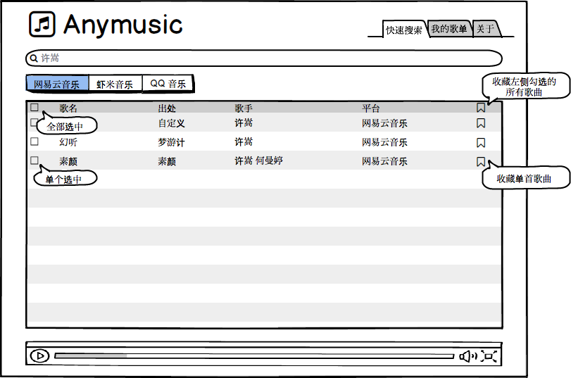
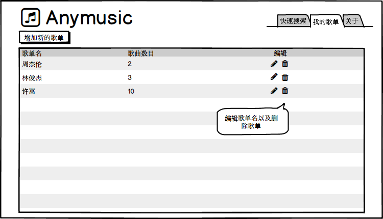
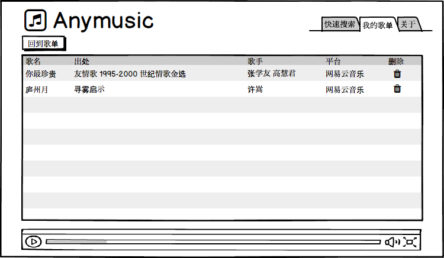
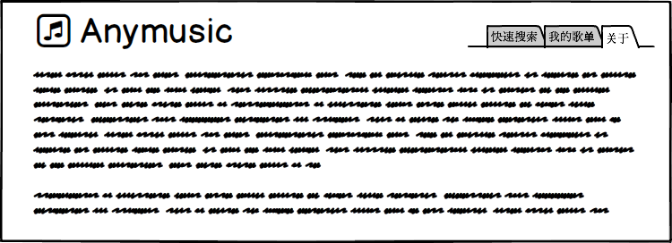

# Anymusic_docs

该项目灵感来自 [listen1](https://github.com/listen1) 项目

但是 listen1 并不满足个人强定制需求，且前后端不分离，遂有此项目

## 个人需求

个人对一个音乐播放器主要有如下两点需求：

- 能够进行关键字搜索，且搜索结果能够按序播放
- 创建歌单，添加歌曲

## 其他细节

关于 anymusic 实现的其他主要细节：

- 无注册、登录步骤，已创建的歌单保存在本地，尽量保证轻量级实现
- 支持三大平台搜索（网易云，虾米，QQ）

## 接口

各种实现均采用前后端分离，后端 api 由 [anymusic/api](https://github.com/anymusic/api) 项目提供

## 可能的实现

该项目为长期个人学习项目，带有极大的个人感情色彩，预计可能会有的实现如下：

- [ ] React
  - [ ] Redux
  - [ ] Redux + React-Redux
  - [ ] Mobx
  - [ ] Next.js
- [ ] Vue
  - [ ] SPA
  - [ ] Nuxt.js
- [ ] Electron-React
- [ ] Electron-Vue
- [ ] 小程序
- [ ] React-Native
- [ ] Weex

其他还有一些实现，比如 PWA，[nuxt+electron](https://github.com/nuxt-community/electron-template)，TypeScript 版本，学有余力，可以研究下

## 草图

主页/搜索页：

我的歌单：

歌单详情页：

关于：

## 具体实现

相关实现的 UI 框架可自行选择

### 公共 header 

公共 header 包括两部分

- 左侧为 anymusic logo 以及相关字样
- 右侧为导航，包括「快速搜索」、「我的歌单」以及「关于」三部分

### 具体页面

- 首页，即搜索页面，路由 `/` 以及 `/search`
  - 搜索框
  - 三大平台切换 tab
  - 搜索结果列表
    - 歌名
    - 出处
    - 歌手
    - 平台
    - 可收藏到我的歌单（单个收藏/多个收藏）
  - 播放器
    - 播放/暂停
    - 上一首/下一首
- 我的歌单页面，路由 `/playlist`
  - 增加新歌单
  - 我的歌单列表
    - 歌单名
    - 歌曲数目
    - 编辑选项（包括编辑以及删除）
- 具体歌单详情页，路由 `/playlist/:id`
  - 回到歌单
  - 具体歌曲列表
    - 歌名
    - 出处
    - 歌手
    - 平台
    - 删除
  - 播放器
    - 播放/暂停
    - 上一首/下一首
- 关于页面，路由 `/about`

## 最后

我也不知道什么时候能实现如上这些，现在是 2018/11/13，嗯，期待五年内吧，也有可能永远实现不了吧，谁知道呢